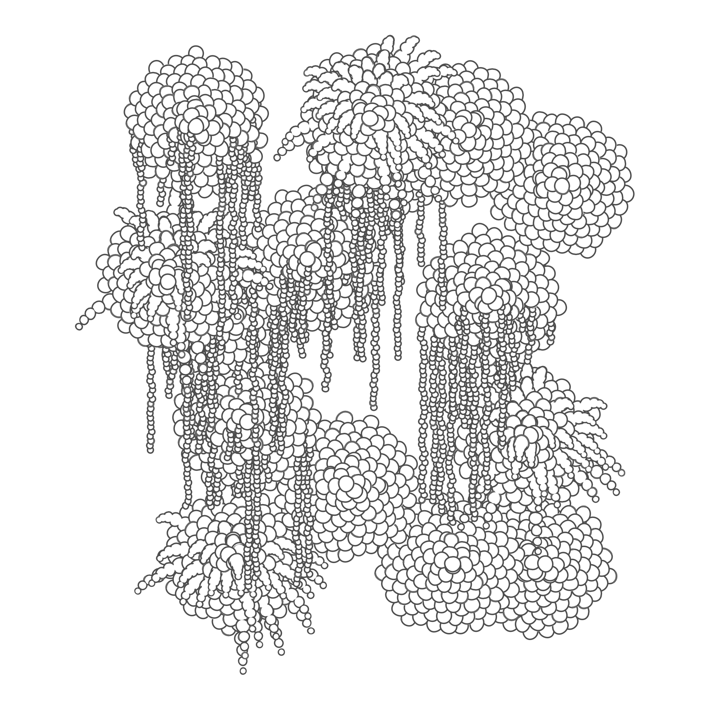
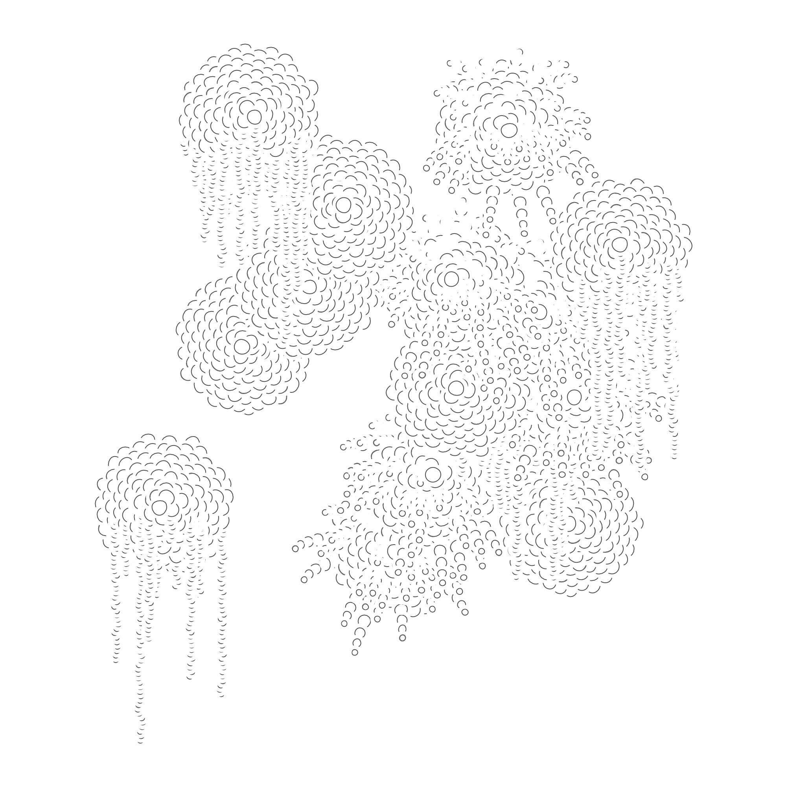
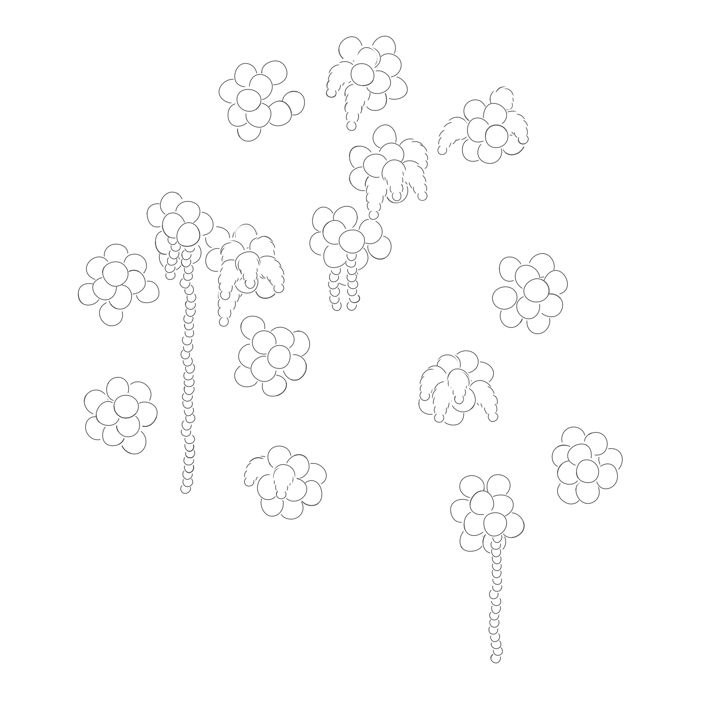
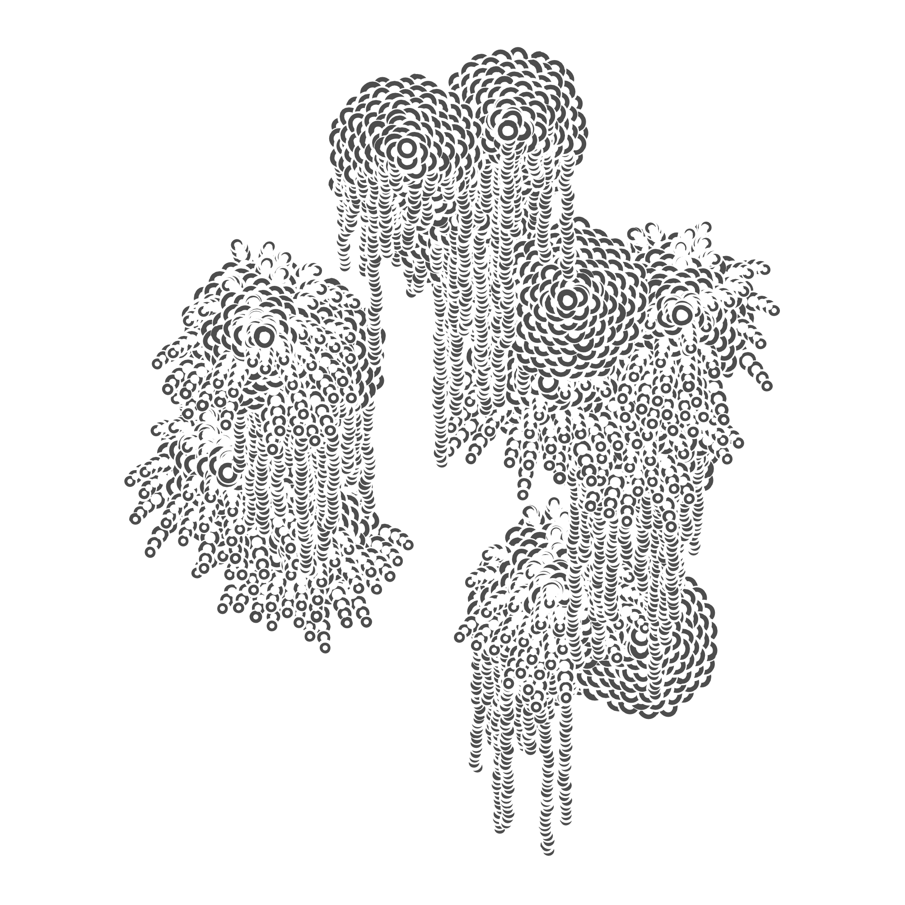
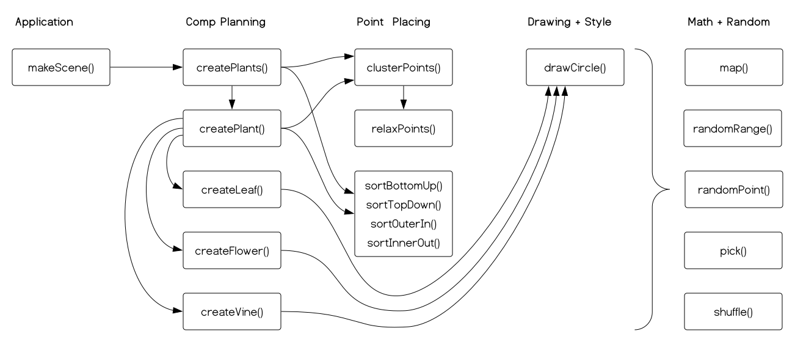

## Case Study: Paper Garden

Paper Garden is a program written in about 300 lines of PaperScript using [Paper.js](http://paperjs.org/). It generates stylized drawings of plants arranged in a wall garden. The plants are rendered as clumps of leaves, sometimes with hanging vines or long drooping flowers. All of this is drawn in rough little circles meant to simulate pen doodles in a sketchbook.

The image above was drawn by the Paper Garden script, configured to generate, compose, and draw 255 plants. The script allows you to configure the number and spacing of plants; the number, spacing, and sorting of leaves on each plant; and how rough, sloppy, and thick the strokes are. This allows the script to squeeze out a few different looks.

::: .three-up .full-width

/::

You can configure, edit, and run the script in the editor below, or go on to read a breakdown of how it works.

::: js-lab
/vectors/paper_garden/paper_garden.js
/::

## Overview

Paper Garden is written in [PaperScript](http://paperjs.org/tutorials/getting-started/working-with-paper-js/), a Paper.js extension of Javascript that supports using mathematical operators on Paper.js objects. Other than that, PaperScript is basically the same as Javascript.

Paper Garden is written in a [procedural](https://en.wikipedia.org/wiki/Procedural_programming) style and comprises 18 functions. The diagram below organizes these functions into general responsibilities and maps out he key relationships between them.

#### Application

The application doesn't have much of an interface: you load it and it draws plants. `makeScene()` is the main entry point for the application.

#### Composition Planning

These functions build the structure of the drawing. `createPlants()` decides where plants will go and what kind they should be. `createPlant()` creates the leaves, flowers and vines that make up an individual plant. `createLeaf()`, `createFlower()`, and `createVine()` draw the plant parts.

#### Point Placing

These functions generate an array of nicely arranged points. `clusterPoints()` creates some randomly placed points near `0,0` and then calls `relaxPoints()` to space them out. `relaxPoints()` repeatedly compares each pair of points and pushes them apart if they are too close.

The `sort*()` functions take an array of points and reorders them based on their positions. Shapes drawn early will be covered up by later shapes, so the order of the points in the array has a big impact on the look of the drawing.

For more on point placing see the chapter on [strategies](/strategy).

#### Drawing + Style

The `create*()` functions all call `drawCircle()` to create the individual circles in the drawing. The look of the circles created by `drawCircle()` is configured through global parameters.

#### Math + Random Utilities

These functions are called from all over the program.

- `map()` map a value from one range to another
- `randomRange()` creates a random value in a given range
- `randomPoint()` creates a random Point between `-1,-1` and `1,1`
- `pick()` chooses and returns a random item from an array
- `shuffle()` randomly reorders the items in an array

## Drawing The Circles

I want this program to produce a somewhat hand-drawn look,but `new Path.Circle()` makes perfect circles. `drawCiricle()` uses a few tricks and techniques to achieve a more hand drawn appearance.

#### Draw Back to Front

In my sketchbook doodles, I draw front to back.
This program draws back to front, and each circle covers any marks already on the drawing.
This works find for rasterized output on the screen, but won't vector outputs like pen plotters and laser cutters.

#### Distorting the Circle

`rough`
Displaces each control point of the bezier curve by a random amount.

#### Creating Gaps

`drawCircle()` creates an unstroked white circle behind the stroked one. This circle is made larger to create gaps—`GAPPY`—and randomly offset so the gaps are not even—`SLOPPY`.

#### Uneven Stroke Width

Looking closely at my sketchbook drawings shows that the strokes have uneven width and uneven color. To simulate this, `drawCircle()` duplicates the circle path an draws it again with a slightly thicker stroke. This thicker stroke is broken up using `dashOffset` and `dashArray` to create a randomized dash pattern. The effect is subtle, but it helps sell the hand drawn feel.

::: js-lab
/vectors/paper_garden/paper_garden_circle_study.js
/::

## Drawing a Plant

## Composing the Plants
