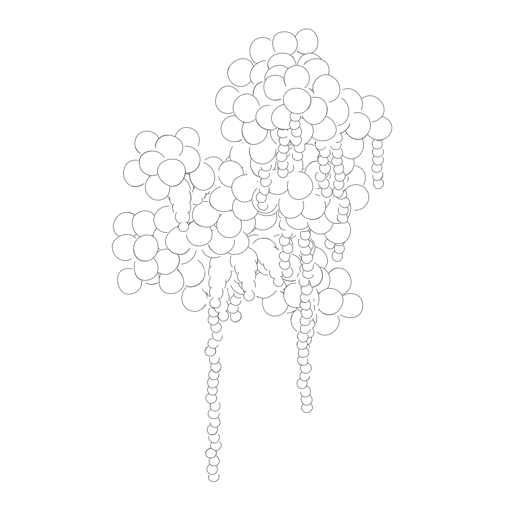
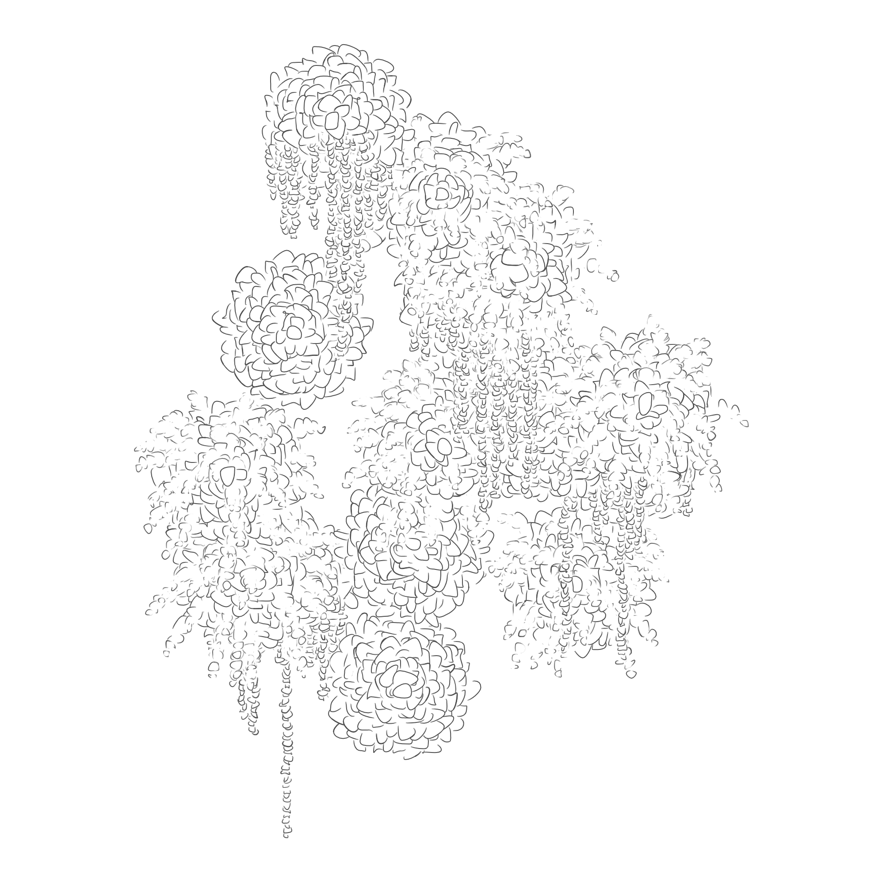
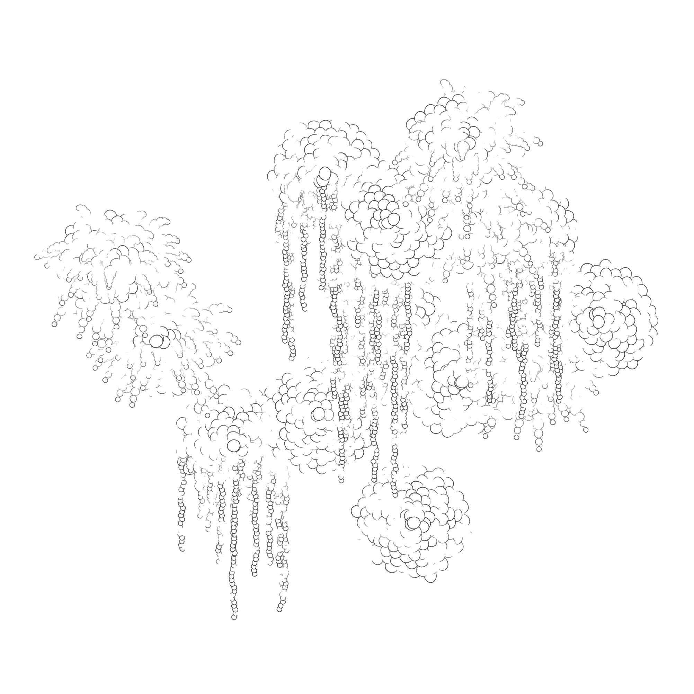
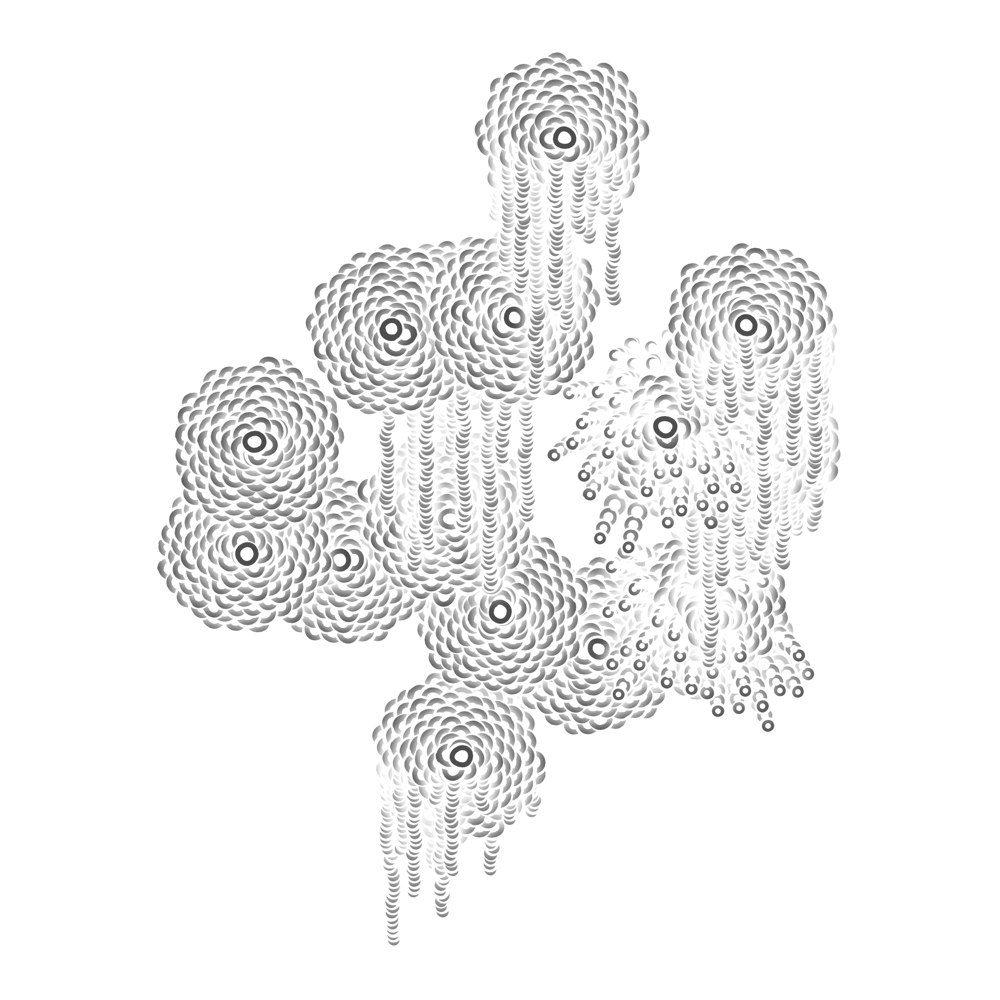
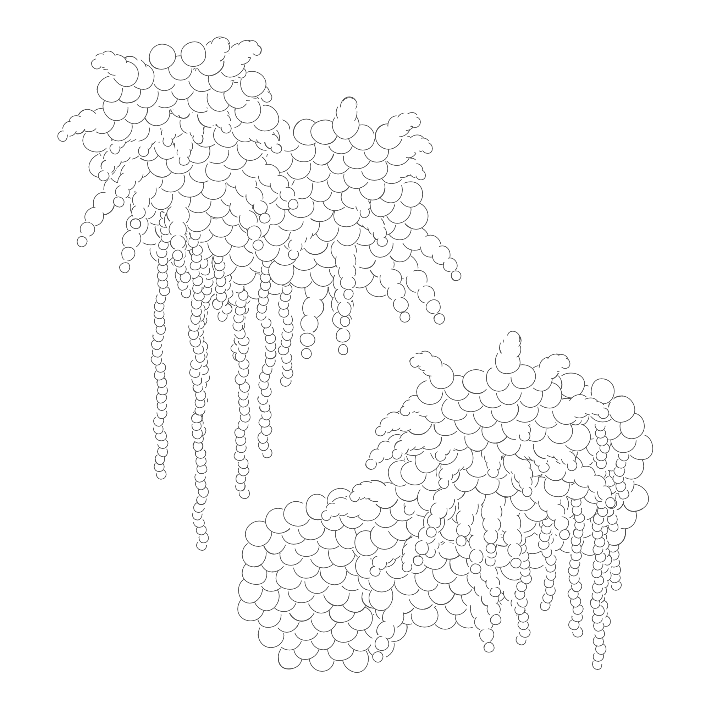
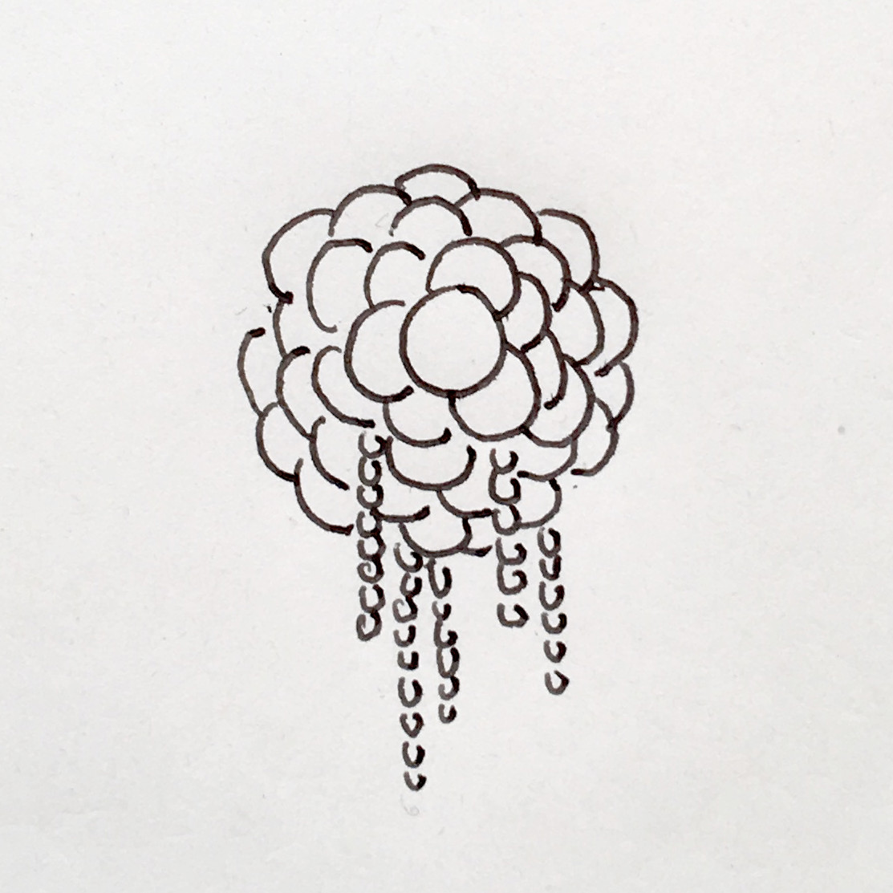

## Case Study: Paper Garden

Paper Garden is a program written in about 300 lines of PaperScript using [Paper.js](http://paperjs.org/). It generates stylized drawings of plants arranged in a wall garden. The plants are rendered as clumps of leaves, sometimes with hanging vines or long drooping flowers. All of this is drawn with rough little circles meant to simulate pen doodles from my sketchbook.

The image above was drawn by the Paper Garden script. For this image the script was configured configured to generate, compose, and draw 255 plants. The script allows you to configure the number and spacing of plants; the number, spacing, and sorting of leaves on each plant; and how rough, sloppy, and thick the strokes are. This allows the script to squeeze out a range of different looks.

::: .three-up .full-width

/::

You can configure, edit, and run the script in the editor below, or go on to read a breakdown of how it works.

::: js-lab
/vectors/paper_garden/paper_garden.js
/::

## Overview

Paper Garden is written in [PaperScript](http://paperjs.org/tutorials/getting-started/working-with-paper-js/), a Paper.js extension of Javascript that supports using mathematical operators on Paper.js objects. Other than that, PaperScript is basically the same as Javascript.

Paper Garden is written in a [procedural](https://en.wikipedia.org/wiki/Procedural_programming) style and comprises 18 functions. The diagram below organizes these functions into general responsibilities and maps out he key relationships between them.

#### Application

The application doesn't have much of an interface: you load it and it draws plants. `makeScene()` is the main entry point for the application.

#### Composition Planning

These functions build the structure of the drawing. `createPlants()` decides where plants will go and what kind they should be. `createPlant()` creates the leaves, flowers and vines that make up an individual plant. `createLeaf()`, `createFlower()`, and `createVine()` draw the plant parts.

#### Point Placing

These functions generate an array of nicely arranged points. `clusterPoints()` creates some randomly placed points near `0,0` and then calls `relaxPoints()` to space them out. `relaxPoints()` repeatedly compares each pair of points and pushes them apart if they are too close.

The `sort*()` functions take an array of points and reorders them based on their positions. Shapes drawn early will be covered up by later shapes, so the order of the points in the array has a big impact on the look of the drawing.

For more on point placing see the chapter on [strategies](/strategy).

#### Drawing + Style

The `create*()` functions all call `drawCircle()` to create the individual circles in the drawing. The look of the circles created by `drawCircle()` is configured through global parameters.

#### Math + Random Utilities

These functions are called from all over the program.

- `map()` map a value from one range to another
- `randomRange()` creates a random value in a given range
- `randomPoint()` creates a random Point between `-1,-1` and `1,1`
- `pick()` chooses and returns a random item from an array
- `shuffle()` randomly reorders the items in an array

## Drawing The Circles

Paper Garden produces images with a somewhat hand-drawn look based on a doodles from my sketchbook, but `new Path.Circle()` makes perfect circles. `drawCiricle()` uses a few tricks and techniques to achieve a more hand-drawn appearance.

#### Draw Back to Front

In my sketchbook doodle, I drew the circles front to back. When drawing with a pen, it is easy to not draw part of the circle and hard to erase marks. In Paper.js the opposite is true. New circles easily cover any marks already on the drawing, and drawing only part of the circle requires substantial extra work. Because of this, Paper Flowers draws from back to front.

::: .callout .warn
This approach works fine for rasterized output on the screen, but won't work on vector outputs like pen plotters or laser cutters which will draw the entire path of each circle even if another circle covers it.
/::

#### Distorting the Circle

The circles in my doodle are not very round. Paper Garden simulates this by displacing each control point of the bezier curve in a random direction. The amount of displacement is controlled by the `ROUGH` parameter.

#### Creating Gaps

The lines in the circles don't always perfectly meet. To recreate this, `drawCircle()` creates an unstroked white circle behind the stroked one. This circle is made larger to create gaps—`GAPPY`—and randomly offset so the gaps are not even—`SLOPPY`.

#### Uneven Stroke Width

The strokes in the doodle have uneven widths and uneven color. In particular, the first little bit of each stroke is heavier than the rest. To simulate this, `drawCircle()` duplicates the circle path an draws it again with a slightly thicker stroke. This thicker stroke is broken up using `dashOffset` and `dashArray` to create a randomized dash pattern.

::: js-show
/vectors/paper_garden/paper_garden_circle_study.js
/::

#### Subtlety

The circles produced by `drawCircle()` are rough, gappy, and uneven, but they are still much more "perfect" than the strokes on the doodle. This is largely an artistic judgement. I wanted to keep some of the richness and subtlety of the hand drawn doodle, but wanted the final image to look less sloppy and rushed.

Also, Paper Flower generates drawings that are much more complex than the doodle above with hundreds of plants and thousands of leaves. This added complexity already makes the overall drawing more rich and interesting. The stroke quality should support that interest without distracting from it.

## Generating a Plant

Individual plants are generated by the `createPlant()` function. This function places the leaves by following these steps:

1. Create a tight cluster of random points between `-1,-1` and `1,1`
2. Use the [relaxation displacement](/strategy/#relaxation-displacement) tactic to space these points out evenly.
3. Sort these points into a desired drawing order.

::: js-show
/vectors/paper_garden/paper_garden_relax_study.js
/::

::: js-lab
/vectors/paper_garden/paper_garden_relax_study.js
/::

## Composing the Plants

The layout of the entire garden is generated by `createPlants()`. This function follows the same steps used to generate the leaves with one additon.

1. Create a tight cluster of random points between `-1,-1` and `1,1`
2. Use the [relaxation displacement](/strategy/#relaxation-displacement) tactic to space these points out evenly.
3. **Remove some randomly selected points to create gaps.**
4. Sort these points into a desired drawing order.
